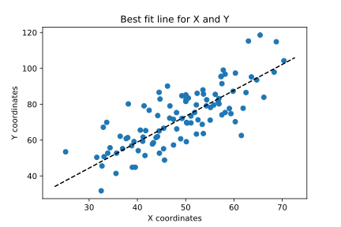
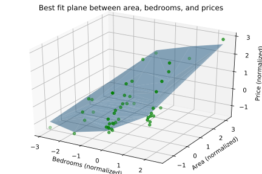
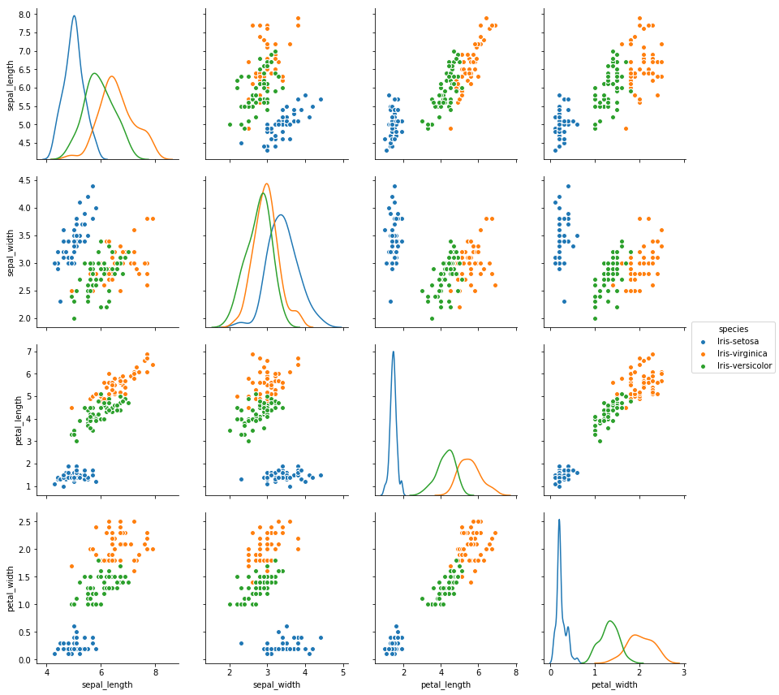

# Machine Learning Algorithms

Implementing classic machine learning algorithms using basic Python libraries, on datasets available publicly on the web. Although this repository focuses on implementation, I am planning to collect my own data and apply these algorithms on them for interesting tasks soon.

__NOTE__: It is recommended to view the iPython Notebook files (.ipynb) on https://nbviewer.jupyter.org/ instead of Github.

### Univariate Linear Regression

Given linear two dimensional data, computes the best fit line, i.e. for new input values, the model predicts corresponding output values for them. 

Using dataset from https://medium.com/we-are-orb/linear-regression-in-python-without-scikit-learn-50aef4b8d122.

### Multivariate Linear Regression

Same goal as Univariate Linear Regression, except that the input is _multi_-dimensional. In this case, the input consists of number of `bedrooms`, and `area` of an apartment, and the algorithm computes the best fit __plane__ which describes the relationship of the input with the `price` of the apartment.

Using dataset from https://medium.com/we-are-orb/multivariate-linear-regression-in-python-without-scikit-learn-7091b1d45905.

### K-Nearest Neighbors Classification

Given the input `sepal_length`, `sepal_width`, `petal_length`, and `petal_width` parameters of an Iris flower, the algorithm tries to predict its species - _setosa_, _virginica_, or _versicolor_. For a particular testing input, the algorithm looks at `k` data points closest to it (in eucledian terms), and determines the best species. Overall, my implementation resulted in __83.79%__ accuracy.

Using the classic Iris dataset from https://archive.ics.uci.edu/ml/datasets/Iris.
It is hard to visualize the actual datapoints in 5 dimensions, so here is the pairplot.

### Naive-Bayes Classification

Given an SMS text message, the algorithm tries to predict whether the text is a `spam` or `ham`. For a particular testing input, the algorithm analyzes each word occuring in it, and using the occurrence of that word within the training set, it decides the tag of the input text. Bayes theorem (conditional probability) is the key idea of this algorithm, and it assumes independence between all features of the text. I used a 'bag of words' representation for each text message. Overall, my implementation resulted in __90.98%__ accuracy.

Using the SMS Spam Collection dataset from UCI's machine learning repository - https://archive.ics.uci.edu/ml/datasets/SMS+Spam+Collection.
